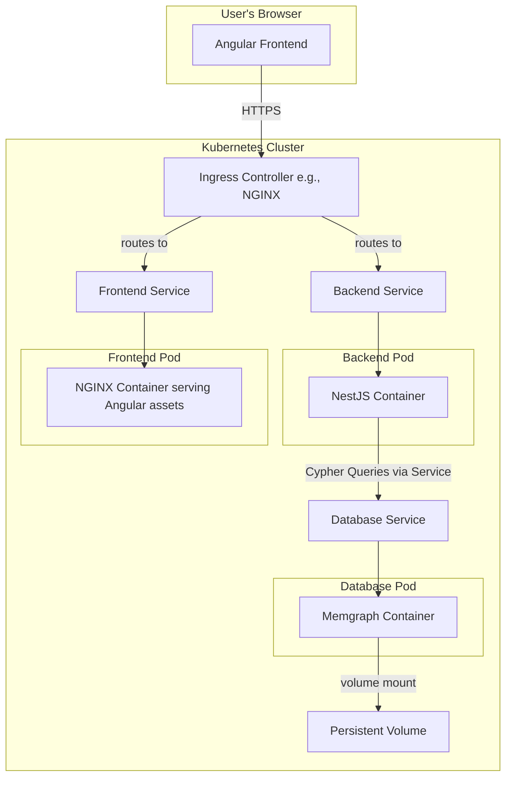
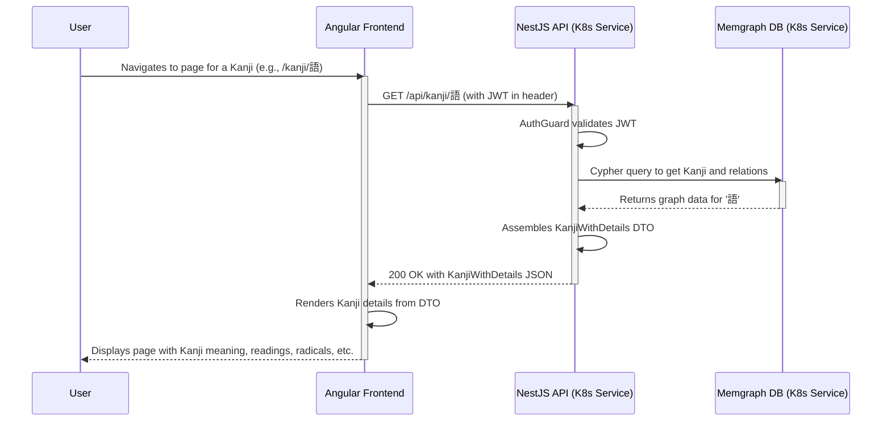

# JP-Aid Fullstack Architecture Document

## Introduction

This document outlines the complete fullstack architecture for JP-Aid, including backend systems, frontend implementation, and their integration. It serves as the single source of truth for AI-driven development, ensuring consistency across the entire technology stack.

This unified approach combines what would traditionally be separate backend and frontend architecture documents, streamlining the development process for modern fullstack applications where these concerns are increasingly intertwined.

## AI-Assisted Development Guidelines

This project is developed with the assistance of AI coding agents. All agents contributing to this repository are required to adhere to the following core principles:

1. **Documentation-Driven Development:** Before writing or modifying code, agents **must** use available documentation retrieval tools (e.g., `Context7`) to fetch up-to-date documentation for any libraries, frameworks, or APIs being used. This prevents the use of deprecated features and ensures adherence to best practices.

2. **Adherence to Project Standards:** Agents must strictly follow all architectural patterns, coding standards, and testing strategies defined within this document and other guiding files in the repository.

3. **Respect for Existing Code:** When modifying existing code, agents should prioritize understanding the current implementation and making incremental, consistent changes rather than large-scale, unnecessary refactors.

### Starter Template or Existing Project

This is a greenfield project initialized using the `create-nx-workspace` command. It establishes a monorepo structure for managing the frontend and backend applications.

### Change Log

| Date | Version | Description | Author |
| :--- | :------ | :---------- | :----- |
|      | 0.2     | Revised for Kubernetes deployment | Winston (Architect) |
|      | 0.1     | Initial Draft | Winston (Architect) |

## High Level Architecture

### Technical Summary

The JP-Aid application is designed as a modern, fullstack application within an Nx monorepo. The architecture features an **Angular** frontend for a rich, interactive user experience, and a **NestJS** backend API providing data to the client. The core of the data layer is **Memgraph**, a high-performance, in-memory graph database, chosen to efficiently manage and traverse the complex relationships between Japanese language concepts. The entire system is designed to be deployed to **Kubernetes**, with local development facilitated by containerization via Docker.

### Platform and Infrastructure Choice

The application will be deployed to a Kubernetes cluster. This choice prioritizes portability and a consistent environment across development, staging, and production, separating the application from any specific cloud provider.

- **Local Development:** Docker Desktop with its built-in Kubernetes engine, or a similar local cluster like Minikube.
- **Production Platform:** Any conformant Kubernetes cluster, whether self-hosted or a managed service (e.g., Amazon EKS, Google GKE, Azure AKS).
- **Infrastructure Management:** Infrastructure will be defined declaratively using Kubernetes manifests, packaged with **Helm**.

**Platform:** Kubernetes (K8s)
**Key Services/Concepts:**

- **Deployments & StatefulSets:** To manage stateless (backend, frontend) and stateful (database) application workloads.
- **Services:** To provide stable network endpoints for inter-service communication.
- **Ingress:** To expose HTTP/HTTPS routes from outside the cluster to services within the cluster.
- **PersistentVolumeClaims (PVCs):** To request durable storage for stateful components like the database.
- **ConfigMaps & Secrets:** To manage application configuration and sensitive data.
- **Helm:** To package and manage the deployment of application resources.

### Repository Structure

The project utilizes a **monorepo** structure, managed by **Nx**. This approach facilitates code sharing, streamlines dependencies, and simplifies cross-application development. A dedicated `kubernetes/` directory will house all deployment manifests.

**Structure:** Monorepo
**Monorepo Tool:** Nx
**Package Organization:**

- `apps/jp-aid`: The main Angular frontend application.
- `apps/api`: The NestJS backend application.
- `libs/shared-interfaces`: TypeScript interfaces shared between the frontend and backend.
- `kubernetes/`: Helm charts and Kubernetes manifests.

### High Level Architecture Diagram



### Architectural Patterns

- **Monorepo:** Manages frontend and backend code in a single repository for streamlined development.
- **Containerization:** All application components (frontend, backend, database) are packaged as Docker images.
- **Microservices-like Architecture:** While not a full microservices system, the frontend and backend are deployed as independent services within Kubernetes, allowing them to be scaled and updated separately.
- **Repository Pattern (Backend):** The NestJS backend will abstract data access logic into repositories, isolating the application from the database.
- **Infrastructure as Code (IaC):** Kubernetes manifests and Helm charts define the entire application deployment declaratively.

## Tech Stack

### Technology Stack Table

| Category | Technology | Version | Purpose | Rationale |
| :--- | :--- | :--- | :--- | :--- |
| **Frontend Language** | TypeScript | ~5.8.2 | Type-safe frontend development | Strong typing, excellent tooling, native to Angular. |
| **Frontend Framework** | Angular | ~20.0.0 | Core frontend framework | Robust framework for building scalable SPAs. |
| **UI Component Library** | Angular Material | ~20.0.0 | High-quality UI components | Provides a suite of well-tested, accessible components. |
| **Backend Language** | TypeScript | ~5.8.2 | Type-safe backend development | Code sharing with frontend, strong typing. |
| **Backend Framework** | NestJS | ~10.0.0 | Building efficient, scalable server-side apps | Provides an opinionated, modular architecture. |
| **API Style** | REST | - | Standard for client-server communication | Well-understood, widely supported. |
| **Database** | Memgraph | latest | Primary graph data store | High-performance in-memory graph database with Cypher. |
| **File Storage** | Kubernetes PVC | - | Persistent storage for assets | Standard K8s primitive for stateful storage. |
| **Authentication** | JWT via Passport.js | - | Secure API authentication | Standard, token-based authentication mechanism. |
| **E2E Testing** | Playwright | ^1.36.0 | End-to-end application testing | Modern, capable E2E testing for the whole app. |
| **Build Tool** | Nx | 21.2.2 | Monorepo build orchestrator | Manages builds, tests, and dependencies efficiently. |
| **IaC Tool** | Helm | v3+ | Kubernetes Package Management | The de-facto standard for packaging K8s applications. |
| **Local Dev Orchestrator** | Tilt | latest | Manages local K8s development environment | Provides fast feedback and live updates for K8s. |
| **CI/CD** | GitHub Actions | - | Continuous integration and deployment | Automates build, test, and deployment pipelines to K8s. |
| **Monitoring** | Prometheus/Grafana | - | System monitoring and visualization | The open-source standard for metrics in Kubernetes. |
| **Logging** | Loki/Promtail | - | Centralized logging | Lightweight, cost-effective, and integrates with Grafana. |
| **CSS Framework** | SCSS | - | Advanced CSS styling | Superset of CSS with more features. |

## Data Models

This section defines the core data structures for the application. It is divided into two parts:

1. **Graph Entities**: These represent the fundamental nodes and their properties as stored in the Memgraph database. This model guides the database schema design.
2. **API Data Transfer Objects (DTOs)**: These represent the data shapes the backend API will send to the frontend. They are often composites of the graph entities, designed to provide the client with all the information needed for a specific view, minimizing the need for follow-up requests.

### Graph Entities

#### Kanji Node

**Purpose:** Represents a single Japanese character. This is the central node in our graph.

**Key Attributes:**

- `id`: string (The character itself, e.g., '語')
- `meaning`: string[]
- `on_readings`: string[]
- `kun_readings`: string[]
- `stroke_count`: number

**Relationships:**

- `[:HAS_RADICAL]` -> (Radical)
- `[:HAS_PRIMITIVE]` -> (Primitive)

#### Radical Node

**Purpose:** Represents an official Kanji radical.

**Key Attributes:**

- `id`: string (The character itself, e.g., '言')
- `stroke_count`: number
- `meaning`: string[]

**Relationships:**

- `[:IS_SUB_RADICAL_OF]` -> (Radical)
- `[:IS_SUPER_RADICAL_OF]` -> (Radical)

#### Primitive Node

**Purpose:** Represents a visual component or sub-component of a Kanji that is not an official radical but is useful for learning.

**Key Attributes:**

- `id`: string (A unique name or character representation, e.g., 'five')
- `meaning`: string

### API Data Transfer Objects (DTOs)

These interfaces will be defined in `libs/shared-interfaces` for use by both the frontend and backend.

#### KanjiWithDetails DTO

**Purpose:** Provides a complete view of a Kanji character and its immediate relationships for display in the UI. This is assembled by the backend and sent to the client.

```typescript
// Defined in libs/shared-interfaces

/**
 * A fundamental Kanji node as stored in the database.
 */
interface Kanji {
  id: string;
  meaning: string[];
  on_readings: string[];
  kun_readings: string[];
  stroke_count: number;
}

/**
 * A Radical node as stored in the database.
 */
interface Radical {
  id: string;
  stroke_count: number;
  meaning: string[];
}

/**
 * A Primitive node as stored in the database.
 */
interface Primitive {
  id: string;
  meaning: string;
}

/**
 * A rich DTO representing a Kanji and its related components,
 * assembled by the API for the frontend.
 */
interface KanjiWithDetails extends Kanji {
  radicals: Radical[];
  primitives: Primitive[];
  // We can extend this with other related data in the future,
  // e.g., similar_kanji: Kanji[]
}
```

## Unified Project Structure

```plaintext
@jp-aid/source/
├── .github/                    # CI/CD workflows
│   └── workflows/
│       └── ci.yaml
├── apps/                       # Application packages
│   ├── jp-aid/                 # Angular frontend application
│   │   ├── src/
│   │   │   ├── app/            # Core application logic, components
│   │   │   ├── assets/         # Static assets like images, fonts
│   │   │   └── environments/   # Environment-specific configuration
│   │   ├── project.json        # Nx project configuration
│   │   └── ...
│   └── api/                    # NestJS backend application
│       ├── src/
│       │   ├── app/            # Core application modules
│       │   │   ├── auth/       # Authentication module
│       │   │   ├── core/       # Core services, guards, etc.
│       │   │   └── feature-x/  # Example feature module
│       │   ├── main.ts         # Application entry point
│       │   └── ...
│       ├── project.json        # Nx project configuration
│       └── ...
├── libs/                       # Shared packages
│   ├── shared-interfaces/      # Shared TypeScript types/interfaces
│   │   ├── src/
│   │   └── project.json
│   └── ui/                     # Shared UI components (optional)
│       ├── src/
│       └── project.json
├── kubernetes/                 # Kubernetes manifests and Helm charts
│   └── helm/
│       └── jp-aid/
│           ├── Chart.yaml
│           ├── values.yaml
│           └── templates/
├── docs/                       # Project documentation
│   ├── prd.md
│   ├── fullstack-architecture.md
│   └── ...
├── .env.example                # Environment variable template
├── nx.json                     # Nx workspace configuration
├── package.json                # Root package.json
└── README.md
```

## REST API Spec

The backend will expose a RESTful API for the frontend. The following defines the key resources and endpoints. All endpoints will be prefixed with `/api`.

Since we are using NestJS, we can leverage the `@nestjs/swagger` package to auto-generate an OpenAPI (Swagger) specification from our DTOs and controller decorators. The initial setup will include this package.

### Resources

- **Kanji:** For retrieving information about Kanji characters and their components.
- **Auth:** For user registration and login.

### Endpoints

#### Authentication

- `POST /api/auth/login`
  - **Description:** Authenticates a user and returns a JWT.
  - **Request Body:** `{ "username": "string", "password": "string" }`
  - **Response:** `{ "access_token": "string" }`

- `POST /api/auth/register`
  - **Description:** Registers a new user.
  - **Request Body:** `{ "username": "string", "password": "string", "email": "string" }`
  - **Response:** `201 Created`

#### Kanji Data

- `GET /api/kanji/:character`
  - **Description:** Retrieves detailed information for a single Kanji character.
  - **Auth:** Required.
  - **Response:** `KanjiWithDetails` DTO.

- `GET /api/kanji/search`
  - **Description:** Searches for Kanji based on meaning or reading.
  - **Auth:** Required.
  - **Query Params:** `?q=...`
  - **Response:** `Kanji[]` (list of basic Kanji info).

This initial specification will be expanded as more features are added. The live, generated OpenAPI spec will serve as the single source of truth for the API contract.

## Core Workflows

This section illustrates key system workflows using sequence diagrams.

### User Views Kanji Details

This workflow describes the process of an authenticated user requesting detailed information for a specific Kanji. It demonstrates the interaction between the frontend, backend, and database, including the authentication check.



## Database Schema

The following Cypher commands define the schema for Memgraph. Specifically, they create indexes on the `id` property for each node type. Indexing this property is critical for fast lookups when querying for a specific Kanji, Radical, or Primitive by its character or name.

These commands are idempotent and should be applied to the database instance upon initialization.

```cypher
-- Create an index on the 'id' property for Kanji nodes
CREATE INDEX ON :Kanji(id);

-- Create an index on the 'id' property for Radical nodes
CREATE INDEX ON :Radical(id);

-- Create an index on the 'id' property for Primitive nodes
CREATE INDEX ON :Primitive(id);
```

## Application Architecture

This section details the internal architecture of the frontend and backend applications.

### Frontend (Angular)

The Angular application follows a standard component-based architecture.

**Component Organization:**

Components will be organized by feature. Reusable, "dumb" components (e.g., custom buttons, cards) will live in a shared UI library within the monorepo (`libs/ui/`).

```text
apps/jp-aid/src/app/
├── components/
│   ├── kanji-search/
│   └── kanji-detail-view/
├── services/
│   ├── api.service.ts      # Handles all HTTP communication
│   └── auth.service.ts     # Manages user authentication state
└── guards/
    └── auth.guard.ts       # Protects routes that require login
```

**State Management:**

For simplicity, initial state management will rely on signal based services. A centralized state store (like NgRx or Akita) will be considered if the application's state complexity grows significantly.

**Routing:**

Angular's built-in router will manage navigation. An `AuthGuard` will protect routes that require an authenticated user.

### Backend (NestJS)

The NestJS application uses a modular architecture, with each primary feature encapsulated in its own module.

**Module Organization:**

```text
apps/api/src/app/
├── auth/
│   ├── auth.module.ts
│   ├── auth.controller.ts
│   └── auth.service.ts
├── kanji/
│   ├── kanji.module.ts
│   ├── kanji.controller.ts
│   ├── kanji.service.ts
│   └── kanji.repository.ts # Handles direct database interaction
└── core/
    ├── guards/
    │   └── jwt-auth.guard.ts
    └── config/
        └── configuration.ts
```

**Data Access:**

The backend employs the **Repository Pattern**. Services will contain the business logic and will call methods in repository classes to interact with the Memgraph database. This isolates the data access logic and makes the application easier to test and maintain. The `kanji.repository.ts` will contain all the Cypher queries.

## Development Workflow

This section outlines the commands for setting up and running the project locally.

### Prerequisites

- Node.js (with npm)
- Docker Desktop (with Kubernetes enabled)
- Tilt

### Initial Setup

1. **Clone the repository:**

    ```bash
    git clone <repo-url>
    cd jp-aid
    ```

2. **Install npm dependencies:**

    ```bash
    npm install
    ```

### Local Development with Tilt

For local development against a Kubernetes cluster, Tilt provides the best experience. It watches your files for changes and automatically builds images and deploys them, providing a live-reloading environment inside Kubernetes.

1. **Ensure Docker Desktop is running with its Kubernetes cluster enabled.**

2. **Start the development environment:**

    ```bash
    tilt up
    ```

    Tilt will open a web UI in your browser (usually at `http://localhost:10350`). This UI shows the status of all your services, build logs, and Kubernetes events. The frontend will be accessible at `http://localhost/` once all services are up and running.

3. **To stop the environment:**

    ```bash
    tilt down
    ```

### Standalone Local Development (No Kubernetes)

If you wish to run the services locally without Kubernetes, you can use the standard Nx serve commands. Note that the database will not be available with this method unless you run it separately.

```bash
# Serve the Angular frontend (e.g., at http://localhost:4200)
npx nx -- serve jp-aid

# Serve the NestJS backend (e.g., at http://localhost:3000)
npx nx -- serve api
```

## Deployment Architecture

The application is designed to be deployed into a Kubernetes cluster. The deployment is managed entirely by a Helm chart located in `kubernetes/helm/jp-aid/`.

- **Frontend Deployment:** The Angular application is compiled into static assets. A multi-stage Dockerfile first builds the app, then copies the assets into a lightweight NGINX container. This container is deployed as a Kubernetes Deployment and exposed via a Service.
- **Backend Deployment:** The NestJS application is bundled into a Node.js server application. Its Dockerfile creates a production-ready image, which is deployed as a Kubernetes Deployment and exposed via a Service.
- **Database Deployment:** Memgraph is deployed as a Kubernetes StatefulSet to ensure stable network identity and persistent storage. A PersistentVolumeClaim (PVC) is used to provision storage for the graph data.
- **Ingress:** An Ingress resource is used to manage external access to the frontend and backend services, routing traffic based on URL paths (e.g., `/api/*` to the backend, `/` to the frontend).

### CI/CD Pipeline

The project will use GitHub Actions for continuous integration and deployment. A workflow will be defined in `.github/workflows/ci.yaml` that automates the following steps on every push to the `main` branch:

1. **Lint & Test:** Run linting and unit tests for both frontend and backend applications using Nx.
2. **Build Docker Images:** Build production Docker images for the frontend and backend.
3. **Push to Registry:** Push the images to a container registry (e.g., Docker Hub, GitHub Container Registry).
4. **Deploy to Kubernetes:** Use the `helm upgrade` command to deploy the new application versions to the production Kubernetes cluster.

A simplified example of the GitHub Actions workflow:

```yaml
# .github/workflows/ci.yaml
name: CI/CD Pipeline

on:
  push:
    branches: [ main ]

jobs:
  build-and-deploy:
    runs-on: ubuntu-latest
    steps:
    - uses: actions/checkout@v3

    - name: Run tests
      run: npx nx -- run-many --target=test --all

    - name: Build and push Docker images
      # Steps to log in to registry, build, and push images

    - name: Deploy to Kubernetes
      # Steps to configure kubectl and run helm upgrade
```

## Testing Strategy

The project employs a multi-layered testing strategy to ensure code quality and application stability. Nx is used to orchestrate the execution of all tests.

### Testing Pyramid

A standard testing pyramid model is adopted: a large base of fast unit tests, a smaller set of integration tests, and a minimal number of slow end-to-end tests.

```text
       E2E Tests (Playwright)
      /                    \
   API Tests (Supertest)  Component Tests (Jest)
  /                                        \
Backend Unit Tests (Jest)      Frontend Unit Tests (Jest)
```

### Unit Testing

- **Backend (NestJS):** Unit tests are written with **Jest**. Each service and controller will have its own test file. The focus is on testing individual methods and business logic in isolation. Repositories will be mocked to avoid actual database calls.
- **Frontend (Angular):** Component logic and services are tested with **Jest**. The focus is on testing component behavior without rendering them to a DOM, ensuring the business logic within the components is correct.

### End-to-End (E2E) Testing

- **Tool:** **Playwright** is used for E2E testing.
- **Scope:** These tests cover critical user flows from start to finish. They run against a fully deployed version of the application (frontend, backend, and database) in a test or staging environment.
- **Example Flow:** A typical E2E test would be:
    1. Log in as a user.
    2. Navigate to the search page.
    3. Search for a Kanji.
    4. Click on a result.
    5. Verify that the correct Kanji details are displayed on the page.

### Running Tests

Nx provides a unified way to run all tests:

```bash
# Run all tests in the workspace
npx nx -- run-many --target=test --all

# Run tests for a specific application
npx nx -- test api
npx nx -- test jp-aid

# Run E2E tests
npx nx -- e2e jp-aid-e2e
```
