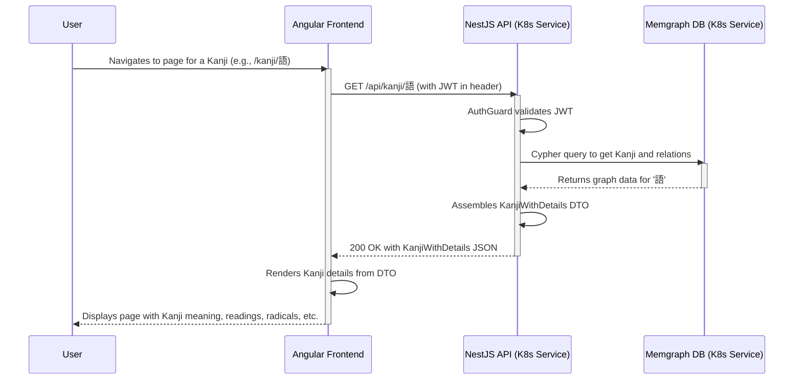

# Core Workflows

This section illustrates key system workflows using sequence diagrams.

## User Views Kanji Details

This workflow describes the process of an authenticated user requesting detailed information for a specific Kanji. It demonstrates the interaction between the frontend, backend, and database, including the authentication check.

