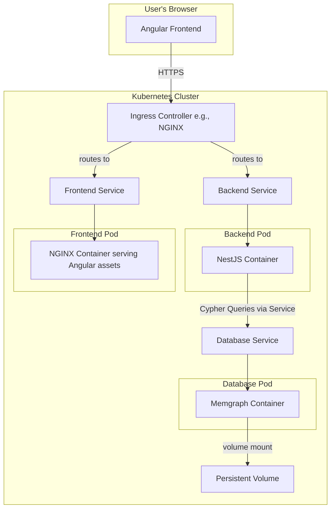

# High Level Architecture

## Technical Summary

The JP-Aid application is designed as a modern, fullstack application within an Nx monorepo. The architecture features an **Angular** frontend for a rich, interactive user experience, and a **NestJS** backend API providing data to the client. The core of the data layer is **Memgraph**, a high-performance, in-memory graph database, chosen to efficiently manage and traverse the complex relationships between Japanese language concepts. The entire system is designed to be deployed to **Kubernetes**, with local development facilitated by containerization via Docker.

## Platform and Infrastructure Choice

The application will be deployed to a Kubernetes cluster. This choice prioritizes portability and a consistent environment across development, staging, and production, separating the application from any specific cloud provider.

- **Local Development:** Docker Desktop with its built-in Kubernetes engine, or a similar local cluster like Minikube.
- **Production Platform:** Any conformant Kubernetes cluster, whether self-hosted or a managed service (e.g., Amazon EKS, Google GKE, Azure AKS).
- **Infrastructure Management:** Infrastructure will be defined declaratively using Kubernetes manifests, packaged with **Helm**.

**Platform:** Kubernetes (K8s)
**Key Services/Concepts:**

- **Deployments & StatefulSets:** To manage stateless (backend, frontend) and stateful (database) application workloads.
- **Services:** To provide stable network endpoints for inter-service communication.
- **Ingress:** To expose HTTP/HTTPS routes from outside the cluster to services within the cluster.
- **PersistentVolumeClaims (PVCs):** To request durable storage for stateful components like the database.
- **ConfigMaps & Secrets:** To manage application configuration and sensitive data.
- **Helm:** To package and manage the deployment of application resources.

## Repository Structure

The project utilizes a **monorepo** structure, managed by **Nx**. This approach facilitates code sharing, streamlines dependencies, and simplifies cross-application development. A dedicated `kubernetes/` directory will house all deployment manifests.

**Structure:** Monorepo
**Monorepo Tool:** Nx
**Package Organization:**

- `apps/jp-aid`: The main Angular frontend application.
- `apps/api`: The NestJS backend application.
- `libs/shared-interfaces`: TypeScript interfaces shared between the frontend and backend.
- `kubernetes/`: Helm charts and Kubernetes manifests.

## High Level Architecture Diagram

## Architectural Patterns

- **Monorepo:** Manages frontend and backend code in a single repository for streamlined development.
- **Containerization:** All application components (frontend, backend, database) are packaged as Docker images.
- **Microservices-like Architecture:** While not a full microservices system, the frontend and backend are deployed as independent services within Kubernetes, allowing them to be scaled and updated separately.
- **Repository Pattern (Backend):** The NestJS backend will abstract data access logic into repositories, isolating the application from the database.
- **Infrastructure as Code (IaC):** Kubernetes manifests and Helm charts define the entire application deployment declaratively.
